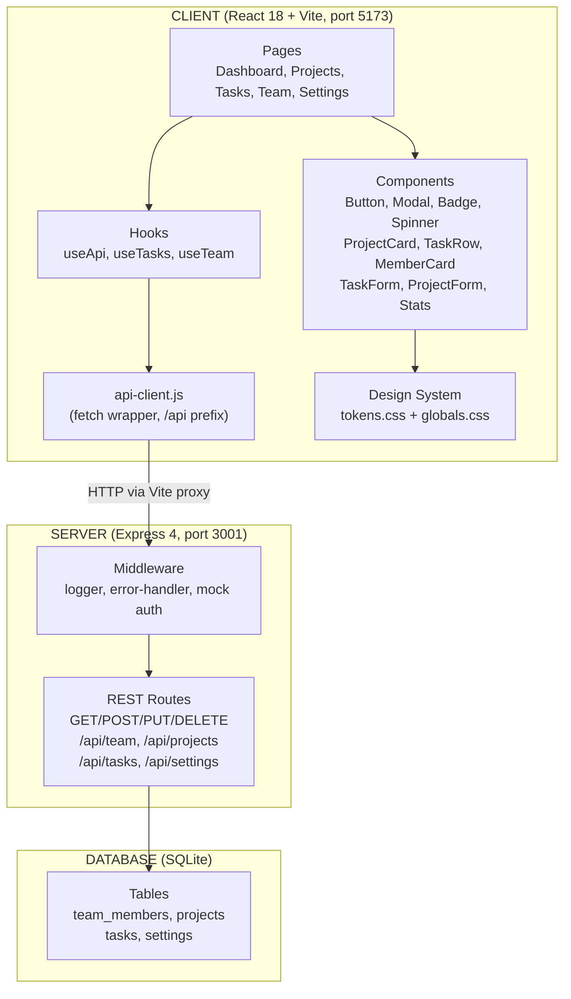

# Architecture Overview

## System Architecture

TaskFlow is a client-server web application with three distinct layers: a React frontend, an Express API backend, and a SQLite database.



### How data flows

1. User navigates to a page (e.g., `/projects`)
2. Page component calls a hook (`useApi('/projects')`)
3. Hook uses `api-client.js` to make an HTTP request to `/api/projects`
4. Vite dev server proxies the request to Express on port 3001
5. Express middleware logs the request and sets mock auth
6. Route handler queries SQLite and returns JSON
7. Hook updates React state, component re-renders

### Database relationships

- `team_members` one-to-many `projects` (via owner_id)
- `team_members` one-to-many `tasks` (via assignee_id)
- `projects` one-to-many `tasks` (via project_id)

### Routes and pages

| Page | Route | Key Components | API Endpoints |
|------|-------|----------------|---------------|
| Dashboard | `/` | Stats, RecentActivity | GET /tasks, GET /projects |
| Projects | `/projects` | ProjectList, ProjectCard, ProjectForm | GET/POST/PUT/DELETE /projects |
| Tasks | `/tasks` | TaskBoard, TaskRow, TaskForm | GET/POST/PUT/DELETE /tasks |
| Team | `/team` | MemberList, MemberCard | GET /team |
| Settings | `/settings` | Settings form | GET/PUT /settings |

### Known bugs

- **Settings nav link** (App.jsx line 33): links to `/setting` instead of `/settings`
- **Stats typo** (Stats.jsx): "Completd Tasks" instead of "Completed Tasks"
- **No validation** (projects.js): POST /projects accepts empty project name

---

## Tech Stack

### Core

| Technology | Version | Purpose |
|------------|---------|---------|
| React | 18.3.1 | Frontend UI framework |
| React Router DOM | 6.23.1 | Client-side routing |
| Vite | 5.2.13 | Build tool and dev server |
| Express.js | 4.19.2 | REST API server |
| better-sqlite3 | 11.1.2 | SQLite database driver |

### Testing

| Technology | Version | Purpose |
|------------|---------|---------|
| Vitest | 1.6.0 | Test runner |
| jsdom | 24.1.0 | Browser DOM simulation |
| @testing-library/react | 15.0.7 | React component testing |
| @testing-library/jest-dom | 6.4.5 | DOM assertions |

### Development

| Tool | Purpose |
|------|---------|
| concurrently | Runs client + server together |
| node --watch | Server auto-restart on file changes |
| Vite proxy | Forwards /api/* to Express |

### Architecture notes

- ES modules throughout (both client and server)
- No TypeScript
- No linting or formatting config
- All state management is component-local (useState + refetch)

---

## UI Components & Design Patterns

### Reusable components (client/src/components/common/)

| Component | Props | Purpose |
|-----------|-------|---------|
| **Button** | variant (primary/secondary/ghost), size, onClick, disabled | Action buttons with hover state |
| **Modal** | isOpen, onClose, title, children | Overlay dialog, click-outside-to-close |
| **Badge** | value (status or priority string) | Pill-shaped colored indicators |
| **Spinner** | (none) | Three pulsing dots loading indicator |

### Domain components

| Component | Location | Purpose |
|-----------|----------|---------|
| TaskRow | components/tasks/ | Grid row displaying task with status/priority badges |
| TaskBoard | components/tasks/ | Board view for tasks |
| TaskForm | components/tasks/ | Create/edit task modal form |
| StatusBadge | components/tasks/ | Task status indicator |
| ProjectCard | components/projects/ | Card with progress bar, owner, task count |
| ProjectList | components/projects/ | Grid of project cards |
| ProjectForm | components/projects/ | Create/edit project form |
| MemberCard | components/team/ | Avatar + name/role/email card |
| MemberList | components/team/ | Grid of member cards |
| Stats | components/dashboard/ | 4-column metric cards |
| RecentActivity | components/dashboard/ | Recent task updates list |

### Design tokens (client/src/styles/tokens.css)

- **Brand:** `--color-primary: #e63f02` (orange), `--color-accent: #fcc403` (yellow)
- **Neutrals:** 8 levels from `--color-bg` (#fafafa) to `--color-text` (#111827)
- **Status:** success (green), warning (amber), error (red), info (blue)
- **Priority:** urgent (red), high (orange), medium (yellow), low (gray)
- **Font:** Outfit via Google Fonts, sizes xs through 3xl
- **Spacing:** 8-point grid, --space-1 (0.25rem) through --space-16 (4rem)
- **Layout:** Sidebar 240px, header 64px, border-radius sm/md/lg/full

### Styling approach

- **Inline style objects** throughout (no CSS modules, no styled-components, no Tailwind)
- **Hover states** managed via useState (onMouseEnter/onMouseLeave)
- **CSS custom properties** referenced in inline styles: `var(--color-primary)`
- **Global CSS classes** for layout (.app-layout, .sidebar, .main-content) and forms (.form-group)

### Reusable patterns for new features

**List page with modal create:**
```jsx
const [showForm, setShowForm] = useState(false);
const { data, refetch } = useApi('/endpoint');
// Button opens Modal → Form onSubmit → api.post → refetch
```

**Card component:** surface background + border + border-radius-lg + padding

**Form layout:** 2-column grid with .form-group class, flex button row at bottom

**Table row:** grid display with fixed column widths, border-bottom separator

---

## Key Files Reference

| File | Purpose |
|------|---------|
| `client/src/App.jsx` | Router setup, sidebar navigation |
| `client/src/main.jsx` | React DOM entry point |
| `client/src/styles/tokens.css` | Design system tokens |
| `client/src/styles/globals.css` | Global layout and form styles |
| `client/src/utils/api-client.js` | Fetch wrapper with /api prefix |
| `client/src/hooks/useApi.js` | Generic data fetching hook |
| `client/src/hooks/useTasks.js` | Task-specific hook with filters |
| `client/src/hooks/useTeam.js` | Team members hook |
| `server/index.js` | Express app setup and middleware |
| `server/db/connection.js` | SQLite connection and initialization |
| `server/db/schema.sql` | Database table definitions |
| `server/db/seed.sql` | Demo data |
| `server/routes/tasks.js` | Task CRUD endpoints |
| `server/routes/projects.js` | Project CRUD endpoints |
| `server/routes/teams.js` | Team member endpoints |
| `server/routes/settings.js` | User settings endpoint |
| `vitest.config.js` | Test configuration |

---

## Development Workflow

```bash
npm run install:all    # Install root + client + server dependencies
npm run dev            # Start client (5173) + server (3001) concurrently
npm test               # Run Vitest test suite
cd server && npm run db:reset  # Reset database to seed data
```
