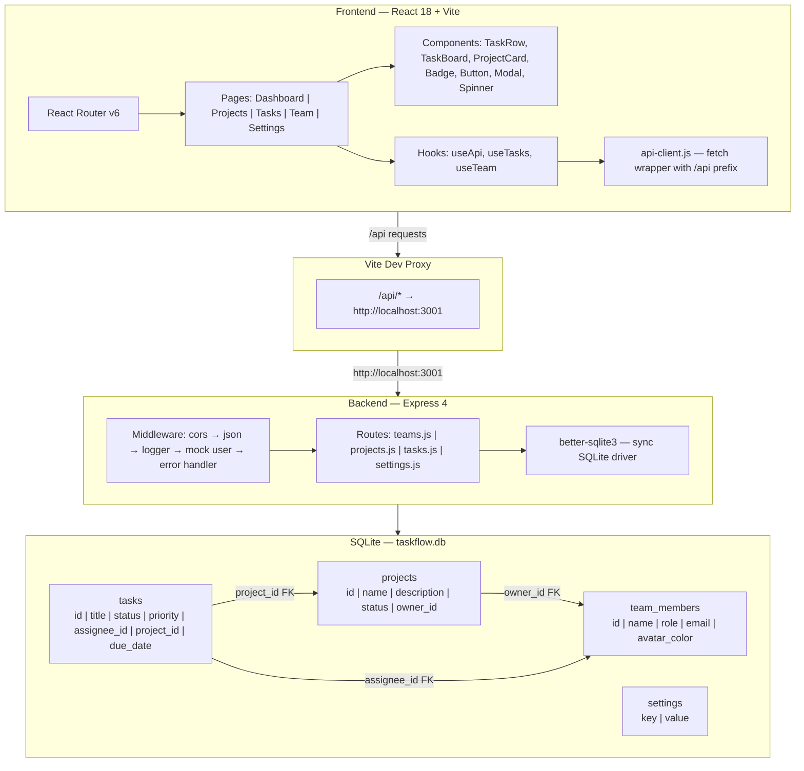

# Architecture Overview

## Quick Summary

TaskFlow is a B2B project management tool for small teams. Users manage projects, tasks, and team workload through five screens: a Dashboard with stats and recent activity, a Projects page with cards and progress bars, a Tasks page with list and kanban views plus filters, a read-only Team directory, and a Settings page. Tasks belong to projects and are assigned to team members; the Dashboard aggregates everything. The app runs React on the frontend, Express on the backend, and SQLite for storage. There are a few planted bugs — a broken Settings nav link, a typo on the Dashboard, and a layout issue in the project grid.

---

## System Architecture

### How it works

When a user creates a task, the form posts to `/api/tasks` with a title, status, priority, assignee, project, due date, and estimated hours. The task shows up in both the list view and the kanban board on the Tasks page, and counts toward the project's progress bar and the Dashboard stats.

Projects, tasks, and team members are all linked — tasks roll up to projects via `project_id`, tasks are assigned to team members via `assignee_id`, and projects have owners via `owner_id`. The Dashboard aggregates across everything to show total tasks, completed count, in-progress count, and active projects.

The Tasks page supports filtering by status and priority via query parameters on the same `/api/tasks` endpoint. Users can toggle between a list view (table rows) and a board view (kanban columns: To Do → In Progress → In Review → Done).

Projects can be created, edited, and deleted. Deleting a project cascades to its tasks. The Team page is read-only — no create or edit. Settings is a flat key-value store with toggles for notifications and dark mode.

**API Endpoints:**

| Area | Endpoints |
|------|-----------|
| Tasks | `GET /api/tasks` (with filters), `GET /api/tasks/:id`, `POST /api/tasks`, `PUT /api/tasks/:id`, `DELETE /api/tasks/:id` |
| Projects | `GET /api/projects`, `GET /api/projects/:id`, `POST /api/projects`, `PUT /api/projects/:id`, `DELETE /api/projects/:id` |
| Team | `GET /api/team`, `GET /api/team/:id`, `GET /api/team/:id/tasks` |
| Settings | `GET /api/settings`, `PUT /api/settings` |
| Health | `GET /api/health` |

### Full detail



**Entry points:**
- Client: `client/src/main.jsx` → mounts React app with `BrowserRouter`
- Server: `server/index.js` → Express on port 3001
- Database: `server/db/connection.js` → auto-creates schema and seeds on first start

**Page routing (App.jsx):**
| Path | Page | Description |
|------|------|-------------|
| `/` | Dashboard | Stats grid + recent activity |
| `/projects` | Projects | Card grid + create modal |
| `/tasks` | Tasks | List/board view + filters + create modal |
| `/team` | Team | Member card grid (read-only) |
| `/settings` | Settings | Toggle switches |

**Component hierarchy:**
```
App (Router + Sidebar)
├── Sidebar (NavLinks + user info)
└── Routes
    ├── Dashboard → Stats, RecentActivity
    ├── Projects → ProjectList → ProjectCard, Modal → ProjectForm
    ├── Tasks → TaskRow / TaskBoard, Modal → TaskForm
    ├── Team → MemberList → MemberCard
    └── Settings → toggle switches
```

**Data fetching pattern:**
- `useApi(endpoint)` — generic hook returning `{ data, loading, error, refetch }`
- `useTasks(filters)` — adds query string building and `updateTask()` mutation
- `useTeam()` — thin wrapper over `useApi('/team')`
- All use `api-client.js` which prefixes `/api`, sets JSON headers, and throws on non-2xx

**Database details:**
- Foreign keys enforced (`PRAGMA foreign_keys = ON`)
- WAL mode enabled for concurrency
- Status constraints: tasks (`todo`, `in-progress`, `in-review`, `done`), projects (`active`, `completed`, `on-hold`)
- Priority constraints: `low`, `medium`, `high`, `urgent`
- Seed data: 7 team members, 4 projects, 50+ tasks

**Known bugs:**
1. **Settings nav link** — `App.jsx` line 33 links to `/setting` (singular) but route is `/settings` → Settings page unreachable from sidebar
2. **Dashboard typo** — `Stats.jsx` line 32 shows "Completd Tasks" instead of "Completed Tasks"
3. **Project grid layout** — `ProjectList.jsx` uses `minmax(300px, 2fr)` instead of `minmax(300px, 1fr)`

---

## Tech Stack

### How it works

React 18 on the frontend, Express on the backend, SQLite for storage. Vite handles the dev server, build, and API proxying. Tests run through Vitest with React Testing Library. No external UI libraries — all components are custom-built. The whole stack is JavaScript (no TypeScript), ES modules throughout.

### Full detail

| Technology | Version | Purpose |
|-----------|---------|---------|
| React | 18.3.1 | UI framework |
| React Router | 6.23.1 | Client-side routing |
| Vite | 5.2.13 | Dev server, build tool, API proxy |
| Express | 4.19.2 | HTTP server |
| better-sqlite3 | 11.1.2 | Synchronous SQLite driver |
| cors | 2.8.5 | Cross-origin middleware |
| Vitest | 1.6.0 | Test runner |
| React Testing Library | 15.0.7 | Component testing |
| jsdom | 24.1.0 | DOM simulation for tests |
| concurrently | 8.2.2 | Parallel dev server startup |
| @vitejs/plugin-react | 4.3.0 | React JSX transformation |

**Configuration files:**
| File | Controls |
|------|----------|
| `client/vite.config.js` | Dev server, `/api` proxy to :3001, test environment (jsdom) |
| `vitest.config.js` | Root test config — jsdom, globals, test file pattern |
| `client/src/test-setup.js` | Imports `@testing-library/jest-dom` matchers |

**Server middleware stack (in order):**
1. `cors()` — cross-origin requests
2. `express.json()` — JSON body parsing
3. `logger` — logs `METHOD URL STATUS DURATIONms`
4. Mock user — injects `req.user = { id: 1, name: 'You', role: 'Product Manager' }`
5. Route handlers — `/api/team`, `/api/projects`, `/api/tasks`, `/api/settings`
6. `errorHandler` — catches errors, returns `{ error: message }` with status

---

## UI Components & Design Patterns

### How it works

There are buttons in three styles (primary, secondary, ghost), color-coded badges for status and priority, a modal component that wraps all create/edit forms, and a loading spinner. Everything follows a design system with a consistent color palette (brand orange `#e63f02`, status colors for success/warning/error/info, neutral grays), the Outfit font, and an 8px spacing grid. All styling uses inline style objects with CSS custom properties from `tokens.css` — no CSS modules, no styled-components. New features can reuse all of this.

### Full detail

**Common components:**

| Component | File | Props | Notes |
|-----------|------|-------|-------|
| **Button** | `components/common/Button.jsx` | `variant` (primary/secondary/ghost), `size` (default/small), `onClick`, `disabled`, `style` | Hover state via useState |
| **Badge** | `components/common/Badge.jsx` | `value` (status/priority code), `style` | Pill-shaped, auto-capitalizes, color-mapped |
| **Modal** | `components/common/Modal.jsx` | `isOpen`, `onClose`, `title`, `children` | Click-outside-to-close, scroll lock, max-width 500px |
| **Spinner** | `components/common/Spinner.jsx` | none | Three-dot pulse animation, primary color |
| **StatusBadge** | `components/tasks/StatusBadge.jsx` | `status` | Thin wrapper over Badge |

**Badge color map:**

| Value | Background | Text Color |
|-------|-----------|------------|
| todo | `--color-border-light` | `--color-text-secondary` |
| in-progress | `--color-info-light` | `--color-info` |
| in-review | `--color-accent-light` | #b8860b |
| done | `--color-success-light` | `--color-success` |
| urgent | `--color-error-light` | `--color-priority-urgent` |
| high | #fff7ed | `--color-priority-high` |
| medium | `--color-accent-light` | #92700c |
| low | `--color-border-light` | `--color-priority-low` |
| active | `--color-success-light` | `--color-success` |
| completed | `--color-border-light` | `--color-text-secondary` |
| on-hold | `--color-warning-light` | `--color-warning` |

**Feature components:**

| Component | File | Purpose |
|-----------|------|---------|
| TaskRow | `components/tasks/TaskRow.jsx` | 5-column grid row: title, assignee, status badge, priority badge, due date |
| TaskBoard | `components/tasks/TaskBoard.jsx` | 4-column kanban (To Do, In Progress, In Review, Done) |
| TaskForm | `components/tasks/TaskForm.jsx` | 8-field form in 2-column grid layout |
| ProjectCard | `components/projects/ProjectCard.jsx` | Card with name, status badge, description, progress bar, owner |
| ProjectList | `components/projects/ProjectList.jsx` | Auto-fill responsive grid of ProjectCards |
| ProjectForm | `components/projects/ProjectForm.jsx` | 3-field form, conditional create/update button text |
| Stats | `components/dashboard/Stats.jsx` | 4-column grid: total, completed, in-progress, active projects |
| RecentActivity | `components/dashboard/RecentActivity.jsx` | Sorted task list (excludes todo, limit 8) |
| MemberCard | `components/team/MemberCard.jsx` | Avatar circle with initials + name, role, email |
| MemberList | `components/team/MemberList.jsx` | Auto-fill responsive grid of MemberCards |

**Design tokens (tokens.css):**

| Category | Tokens |
|----------|--------|
| Brand | `--color-primary` (#e63f02), `--color-primary-hover`, `--color-primary-light`, `--color-accent` (#fcc403) |
| Neutrals | `--color-bg`, `--color-surface`, `--color-surface-hover`, `--color-border`, `--color-border-light`, `--color-text`, `--color-text-secondary`, `--color-text-muted` |
| Status | `--color-success/warning/error/info` + light variants |
| Priority | `--color-priority-urgent/high/medium/low` |
| Typography | Outfit font, sizes xs–3xl, weights 300–700 |
| Spacing | 8px grid: `--space-1` (0.25rem) through `--space-16` (4rem) |
| Borders | `--border-radius-sm` (6px), `-md` (8px), `-lg` (12px), `-full` (9999px) |
| Shadows | `--shadow-sm/md/lg` |
| Transitions | `--transition-fast` (150ms), `--transition-base` (200ms) |
| Layout | `--sidebar-width` (240px), `--header-height` (64px) |

**Style patterns:**
- All components use inline style objects (no CSS modules)
- Global CSS classes for layout only: `.app-layout`, `.sidebar`, `.main-content`, `.card`, `.form-group`
- Colors/spacing always reference CSS custom properties via `var(--token)`
- Hover states managed via React `useState`
- Responsive grids use `repeat(auto-fill, minmax(Xpx, 1fr))`

**Custom hooks:**

| Hook | Signature | Returns |
|------|-----------|---------|
| `useApi` | `useApi(endpoint, { skip? })` | `{ data, loading, error, refetch }` |
| `useTasks` | `useTasks(filters?)` | `{ data, loading, error, refetch, updateTask }` |
| `useTeam` | `useTeam()` | `{ data, loading, error, refetch }` |

**Utilities:**

| Utility | Functions |
|---------|-----------|
| `api-client.js` | `api.get()`, `api.post()`, `api.put()`, `api.delete()` — prefixes `/api`, JSON headers, throws on error |
| `format-date.js` | `formatDate()` → "Jan 15, 2024", `formatRelativeDate()` → "3d overdue" / "Due in 5d", `isOverdue()` → boolean |

---

## Key Files Reference

| File | Purpose |
|------|---------|
| `client/src/main.jsx` | React entry point — mounts app with BrowserRouter |
| `client/src/App.jsx` | Route definitions + sidebar navigation |
| `client/src/utils/api-client.js` | Fetch wrapper — all API calls go through here |
| `client/src/hooks/useApi.js` | Generic data-fetching hook |
| `client/src/hooks/useTasks.js` | Task fetching with filters + updateTask mutation |
| `client/src/styles/tokens.css` | Design system — all CSS custom properties |
| `client/src/styles/globals.css` | Global layout styles |
| `server/index.js` | Express app — middleware stack + route mounting |
| `server/routes/tasks.js` | Task CRUD with filter support |
| `server/routes/projects.js` | Project CRUD with task count aggregation |
| `server/routes/teams.js` | Team member read endpoints |
| `server/routes/settings.js` | Key-value settings store |
| `server/db/connection.js` | SQLite init — creates schema + seeds on first run |
| `server/db/schema.sql` | Table definitions with constraints and FKs |
| `server/db/seed.sql` | Sample data — 7 members, 4 projects, 50+ tasks |
| `server/middleware/logger.js` | Request logging (method, URL, status, duration) |
| `server/middleware/error-handler.js` | Centralized error handling |
| `vitest.config.js` | Root test configuration |

---

## Development Workflow

```bash
# First-time setup
npm run install:all        # Install root, client, and server deps

# Development
npm run dev                # Start both servers (client :5173, server :3001)

# Testing
npm test                   # Run all tests (Vitest, one-shot mode)

# Database
cd server && npm run db:reset  # Delete and reinitialize SQLite DB

# Individual servers
npm run dev:client         # Vite dev server only
npm run dev:server         # Express server only (with --watch)

# Production build
cd client && npm run build    # Vite production build
cd client && npm run preview  # Preview production build
```
