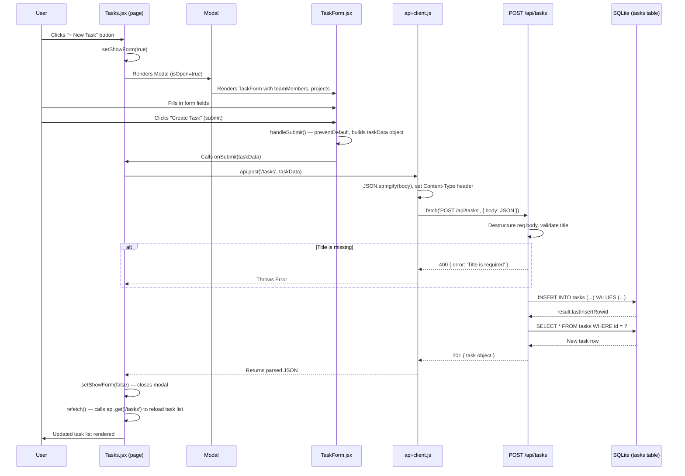

# Task Creation Flow

## Sequence Diagram



## Written Walkthrough

### Step 1: User clicks "+ New Task"

**File:** `client/src/pages/Tasks.jsx`, line 52

The Tasks page renders a `Button` with the label "+ New Task". Clicking it calls `setShowForm(true)`, which flips the `showForm` state to `true`. This causes the `Modal` component (line 102) to render with `isOpen={true}`, displaying the `TaskForm` inside it.

The `TaskForm` receives four props:
- `onSubmit` — the `handleCreate` function defined at line 34
- `onCancel` — a callback that sets `showForm` back to `false`
- `teamMembers` — fetched via the `useTeam` hook (line 31)
- `projects` — fetched via `useApi('/projects')` (line 32)

### Step 2: User fills the form

**File:** `client/src/components/tasks/TaskForm.jsx`, lines 1-93

The form manages eight fields via individual `useState` hooks:

| Field | Default | HTML Element | Required |
|-------|---------|-------------|----------|
| `title` | `''` | text input | Yes (`required` attribute) |
| `description` | `''` | textarea | No |
| `status` | `'todo'` | select (todo, in-progress, in-review, done) | Yes (always has value) |
| `priority` | `'medium'` | select (low, medium, high, urgent) | Yes (always has value) |
| `assigneeId` | `''` | select (team members + "Unassigned") | No |
| `projectId` | `''` | select (projects + "No project") | No |
| `dueDate` | `''` | date input | No |
| `estimatedHours` | `''` | number input (min 0, step 0.5) | No |

The `required` attribute on the title input provides browser-native validation; the form won't submit without it.

### Step 3: Form submission builds the data object

**File:** `client/src/components/tasks/TaskForm.jsx`, lines 14-26

When the user clicks "Create Task", the `handleSubmit` function fires. It calls `e.preventDefault()` to stop the default form submission, then constructs a plain object from the form state:

```js
{
  title,
  description,
  status,
  priority,
  assignee_id: assigneeId || null,
  project_id: projectId || null,
  due_date: dueDate || null,
  estimated_hours: estimatedHours ? Number(estimatedHours) : 0,
}
```

Key transformations:
- `assigneeId`, `projectId`, and `dueDate` convert empty strings to `null`
- `estimatedHours` converts to a `Number`, defaulting to `0` if empty

This object is passed to the `onSubmit` prop, which is `handleCreate` in `Tasks.jsx`.

### Step 4: handleCreate sends the API request

**File:** `client/src/pages/Tasks.jsx`, lines 34-38

The `handleCreate` function calls `api.post('/tasks', taskData)`. It `await`s the result, then closes the modal (`setShowForm(false)`) and calls `refetch()` to reload the task list from the server.

There is no try/catch here. If the API call fails, the error propagates as an unhandled promise rejection. The modal stays open (since `setShowForm(false)` never runs), but no error message is shown to the user.

### Step 5: api-client sends the HTTP request

**File:** `client/src/utils/api-client.js`, lines 1-32

`api.post` calls `apiClient(endpoint, { method: 'POST', body: data })`. The `apiClient` function:

1. Prepends `/api` to the endpoint, forming the URL `/api/tasks`
2. Sets `Content-Type: application/json` in the headers
3. Detects that `body` is an object and calls `JSON.stringify()` on it (line 14)
4. Calls `fetch(url, config)` to make the actual HTTP request
5. Checks `response.ok`. If false, it tries to parse the error JSON and throws an `Error` with the message
6. On success, returns `response.json()` (the parsed response body)

The Vite dev server proxies `/api` requests to the Express backend on port 3001.

### Step 6: Express route handles the POST

**File:** `server/routes/tasks.js`, lines 61-85

The `POST /` handler:

1. Gets a database connection via `getDb()`
2. Destructures the eight fields from `req.body` (line 63)
3. Validates that `title` exists. If missing, returns `400 { error: 'Title is required' }` (lines 65-67)
4. Runs an `INSERT INTO tasks` statement with parameterized values (lines 69-81). Default handling on the server side mirrors the client: `description` defaults to `''`, `status` to `'todo'`, `priority` to `'medium'`, optional fields to `null` or `0`
5. Retrieves the newly created row using `result.lastInsertRowid` (line 83)
6. Returns the task object with status `201` (line 84)

Server-side validation is minimal: only `title` is checked. The database schema provides additional constraints via `CHECK` clauses on `status` and `priority` columns, which would cause a SQLite error if invalid values were passed.

### Step 7: Database insertion

**File:** `server/db/schema.sql`, lines 20-32

The `tasks` table schema:

- `id` — auto-incrementing primary key
- `title` — `TEXT NOT NULL`
- `description` — `TEXT`, nullable
- `status` — `TEXT`, defaults to `'todo'`, constrained to `('todo', 'in-progress', 'in-review', 'done')`
- `priority` — `TEXT`, defaults to `'medium'`, constrained to `('low', 'medium', 'high', 'urgent')`
- `assignee_id` — `INTEGER`, foreign key to `team_members(id)`
- `project_id` — `INTEGER`, foreign key to `projects(id)`
- `due_date` — `TEXT`, nullable (stored as ISO date string)
- `estimated_hours` — `REAL`, defaults to `0`
- `created_at` — `TEXT`, auto-set to `datetime('now')`
- `updated_at` — `TEXT`, auto-set to `datetime('now')`

Foreign keys reference `team_members` and `projects` tables but are not enforced by default in SQLite (requires `PRAGMA foreign_keys = ON`).

### Step 8: Response flows back to the UI

After the `INSERT`, the server reads back the full row and sends it as JSON with a `201` status code. The `apiClient` parses this response. Control returns to `handleCreate` in `Tasks.jsx`, which:

1. Closes the modal by setting `showForm` to `false`
2. Calls `refetch()`, which is the `fetchData` function from the `useTasks` hook

### Step 9: Task list refreshes

**File:** `client/src/hooks/useTasks.js`, lines 16-27

`refetch()` triggers `fetchData`, which calls `api.get('/tasks')` (with any active filter query string). The GET handler in `server/routes/tasks.js` (line 7) runs a `SELECT` with JOINs to include `assignee_name` and `project_name`. The result replaces the `data` state, causing the task list or board to re-render with the new task included.

## Notable Gaps

- **No client-side error handling on create.** The `handleCreate` function has no try/catch; API errors silently fail. The modal stays open but the user gets no feedback.
- **No loading indicator during submission.** The form has no disabled/loading state while the request is in flight, so double-clicks could create duplicate tasks.
- **Minimal server validation.** Only `title` presence is checked. Invalid `status` or `priority` values would fail at the database level with an unhelpful SQLite error rather than a clean 400 response.
- **Foreign keys not enforced.** SQLite foreign key constraints are off by default. An invalid `assignee_id` or `project_id` would be silently accepted.
- **No optimistic update.** The full task list is refetched after creation rather than appending the new task to the existing state.
