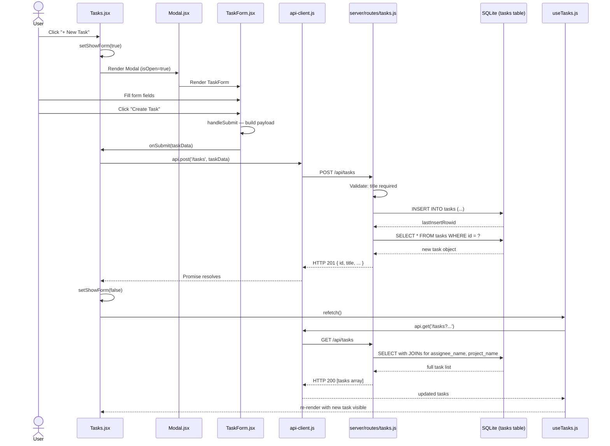

# Create Task Flow: End-to-End Trace

## Overview

The "create a task" flow spans four layers: UI trigger, form component, API communication, and server-side persistence. Below is the complete journey from button click to new task appearing on screen.

## Sequence Diagram

## Step-by-Step Walkthrough

### Step 1: User clicks "+ New Task"
**File:** `client/src/pages/Tasks.jsx`

The Tasks page header has a Button that sets `showForm` state to true, which opens a Modal containing the TaskForm component. The modal receives `handleCreate` as its `onSubmit` callback.

### Step 2: User fills and submits the form
**File:** `client/src/components/tasks/TaskForm.jsx`

TaskForm is a controlled form with 8 fields:
- **Title** (required text input)
- **Description** (optional textarea)
- **Status** (select — defaults to "todo")
- **Priority** (select — defaults to "medium")
- **Assignee** (select from team members, optional)
- **Project** (select from projects, optional)
- **Due Date** (date input, optional)
- **Estimated Hours** (number input, step 0.5, optional)

On submit, `handleSubmit` builds a payload object, mapping camelCase field names to snake_case for the API (`assigneeId` → `assignee_id`, etc.). Empty optional fields become `null`. Estimated hours is cast to `Number()`.

### Step 3: API call fires
**File:** `client/src/utils/api-client.js`

`api.post('/tasks', taskData)` calls the `apiClient` wrapper, which:
1. Prepends `/api` to make the full URL `/api/tasks`
2. Sets `Content-Type: application/json`
3. Stringifies the body
4. Calls `fetch()` — Vite proxies this to Express on port 3001
5. Throws if the response isn't ok
6. Returns the parsed JSON response

### Step 4: Server validates and inserts
**File:** `server/routes/tasks.js`

The POST handler:
1. Extracts fields from `req.body`
2. Returns HTTP 400 if `title` is missing (only validation)
3. Runs a parameterized `INSERT INTO tasks` with all fields
4. Fetches the newly created row by `lastInsertRowid`
5. Returns HTTP 201 with the full task object

The database auto-generates `id`, `created_at`, and `updated_at`.

### Step 5: UI refreshes
**File:** `client/src/pages/Tasks.jsx` + `client/src/hooks/useTasks.js`

Back in `handleCreate`, after the POST succeeds:
1. `setShowForm(false)` closes the modal
2. `refetch()` triggers `useTasks` to re-fetch all tasks from `GET /api/tasks`
3. The server returns the full task list with JOINed `assignee_name` and `project_name`
4. React re-renders the task list — the new task appears

## Key Details

**Field name mapping:** Form uses camelCase (`assigneeId`), API expects snake_case (`assignee_id`). Conversion happens in TaskForm's `handleSubmit`.

**Validation:** Only `title` is validated server-side. No client-side validation beyond HTML `required` attribute.

**After creation:** The entire task list is re-fetched (not optimistically updated). The modal unmounts, resetting form state automatically.

**Error handling:** `apiClient` throws on non-ok responses. The Tasks page doesn't currently catch or display these errors to the user.

## Files Involved

| File | Role |
|------|------|
| `client/src/pages/Tasks.jsx` | Form visibility, handleCreate, refetch |
| `client/src/components/tasks/TaskForm.jsx` | Form fields, state, payload construction |
| `client/src/components/common/Modal.jsx` | Modal overlay + card wrapper |
| `client/src/utils/api-client.js` | HTTP fetch wrapper |
| `client/src/hooks/useTasks.js` | Data fetching hook with refetch |
| `server/routes/tasks.js` | POST handler + GET handler |
| `server/db/schema.sql` | Tasks table definition |
