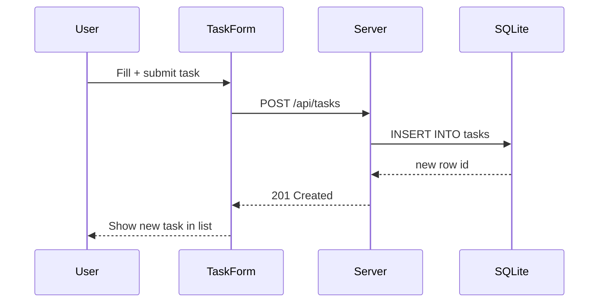

# Task Creation Flow

How a new task moves from the TaskForm UI through the API to the database and back.

## Notes
- `TaskForm.jsx` posts via the `api` helper (`utils/api-client.js`), which prefixes `/api`.
- The Express `tasks` route validates and inserts via better-sqlite3.
- On success the client optimistically appends the new task to the board.
<!-- probe A11 -->
